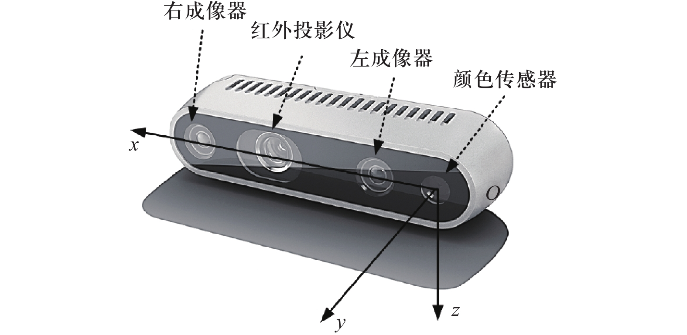

# 安装和使用 RealSense Viewer

在对相机进行 Python 开发时，或者想直接使用相机查看图像时，可能会发现打不开该相机（即使能够检测到有该相机）。

这需要安装 RealSense D435i 的驱动，下载地址为 https://github.com/IntelRealSense/librealsense/releases/tag/v2.56.3

对于 Windows 系统，可选择 Intel.RealSense.SDK-WIN10-2.56.3.7838.beta.exe 进行下载安装（files 文件夹下有备份）。

安装好后，就都能够正常使用了。

参考：[B站上的一个视频](https://www.bilibili.com/video/BV1Pw411k7Y8/?spm_id_from=333.337.search-card.all.click&vd_source=9ac83b3ca683e3dcf6e29152632646e8)


# 配置 Python 开发环境

直接使用 pip 进行安装：

```shell
pip install pyrealsense2
```

使用以下代码进行测试，如果代码运行没问题，则说明安装成功：

```python
import pyrealsense2 as rs
pipe = rs.pipeline()
profile = pipe.start()
try:
  for i in range(0, 100):
    frames = pipe.wait_for_frames()
    for f in frames:
      print(f.profile)
finally:
    pipe.stop()
```

注意：注意 pyrealsense2 仅支持 amd，不支持 arm


参考：

[Github 官方文档 Python 说明](https://github.com/IntelRealSense/librealsense/tree/master/wrappers/python#installation)

[Github 官方文档 Python 示例 Readme](https://github.com/IntelRealSense/librealsense/blob/master/wrappers/python/examples/readme.md)


# 获取 RealSence 拍摄的深度图像和彩色图像

代码示例如下：

```python
import pyrealsense2 as realsense
import numpy

pipeline = realsense.pipeline()
config = realsense.config()
config.enable_stream(realsense.stream.depth, 640, 480, realsense.format.z16, 30)
config.enable_stream(realsense.stream.color, 640, 480, realsense.format.bgr8, 30)

profile = pipeline.start(config)
align = realsense.align(realsense.stream.color)

while True:
  frames = pipeline.wait_for_frames()
  aligned_frames = align.process(frames)
    
  depthFrame = alignedFrames.get_depth_frame()
  colorFrame = alignedFrames.get_color_frame()
  if not depthFrame or not colorFrame:
    continue
    
  color_image = np.asanyarray(color_frame.get_data())
    
  # x,y
  depth = depthFrame.get_distance(x, y)
  depthIntrin = depthFrame.profile.as_video_stream_profile().intrinsics
  X, Y, Z = realsense.rs2_deproject_pixel_to_point(depthIntrin, [x, y], depth)
  print(f"目标3D坐标: X={X:.3f}m, Y={Y:.3f}m, Z={Z:.3f}m")
```

详细的解释如下：

```python
import pyrealsense2 as realsense

# 下面四行代码是使用 Intel RealSense SDK 设置并启动一个 RealSense 相机的数据流
pipeline = realsense.pipeline()  # 创建一个 pipeline（数据通道），负责管理从相机传感器到程序的数据流的对象
config = realsense.config()  # 创建一个 配置对象（config），用来指定想要开启哪些数据流（比如彩色图像、深度图像、红外图像等）、图像分辨率、帧率等
config.enable_stream(realsense.stream.depth, 640, 480, realsense.format.z16, 30)
	# rs.stream.depth 表示深度图像流
  # 640, 480        分辨率
  # rs.format.z16   图像格式，这里是16位的深度图（每个像素16位）
  # 30              帧率（FPS）
config.enable_stream(realsense.stream.color, 640, 480, realsense.format.bgr8, 30)
  # rs.stream.color 彩色图像流
  # 640, 480        分辨率
  # rs.format.bgr8  格式是 BGR 格式的 8-bit 彩色图像（OpenCV 喜欢这个格式）
  # 30              帧率（FPS）

profile = pipeline.start(config)  # 启动 pipeline（数据流），使用前面通过 config 配置好的设置，比如深度流、彩色流、分辨率、帧率等。
  # pipeline.start() 会返回一个 profile 对象，这个对象里面包含了各种和相机流相关的元信息，比如深度流和彩色流的配置、相机内参（intrinsics）、传感器信息等。
align = realsense.align(realsense.stream.color)  # 这行是在做 图像对齐（alignment）
  # RealSense 的深度图像和彩色图像是由不同的摄像头拍摄的，所以它们可能在空间上不对齐。
  # rs.align(rs.stream.color) 创建了一个对齐对象，让深度图像根据 彩色图像的坐标系 来对齐。换句话说，它会把深度图“重投影”到和彩色图一一对应的位置。

while True:
  frames = pipeline.wait_for_frames()  # 从 RealSense 相机中获取一帧新的图像数据，这个帧可能包含多个流，比如深度流、彩色流等。
      # pipeline.wait_for_frames() 会阻塞程序，直到一帧完整的数据到达为止（也就是说它会等着相机拍完照才往下走）。
      # 这个返回的是一个 frameset 对象，里面包含了多个同步对齐过的流（深度、彩色等），但它们还没有根据视觉坐标对齐。      
  aligned_frames = align.process(frames)  # 使用前面创建的 align = rs.align(rs.stream.color) 对象，对刚刚获取的 frames 进行图像对齐处理。
    	# align.process() 会返回一个新的 frameset（这里是 aligned_frames），这个 frameset 中的深度图已经被变换成了与彩色图对齐的视角。也就是说：现在可以放心地在彩色图像的 (cx, cy) 坐标上读取深度值了，两者的像素位置是对得上的！
    
  depth_frame = aligned_frames.get_depth_frame()  # 从对齐的帧集中（aligned_frames）提取出深度图像帧
  color_frame = aligned_frames.get_color_frame()  # 从对齐的帧集中（aligned_frames）提取出彩色图像帧
  if not depth_frame or not color_frame:  # 这段是一个安全性检查，确保我们成功得到了深度帧和彩色帧。
    continue
    
  
  color_image = np.asanyarray(color_frame.get_data())  # color_image 是一个三通道的彩色图像数组，可以直接传给 OpenCV 来做目标检测、显示、绘制等操作。
    
  # x,y
  depth = depthFrame.get_distance(x, y)  # 从对齐后的深度图中，读取中心点 (x, c) 位置的深度值
                                         # 这个值是距离相机镜头的真实物理距离（单位是 米），精度通常在毫米级。
  depthIntrin = depthFrame.profile.as_video_stream_profile().intrinsics  # 获取当前深度帧对应的相机内参（intrinsics），用于后续将像素坐标 + 深度 转换为实际 3D 空间坐标。
    # .as_video_stream_profile() 把通用 profile 转成视频流格式
    # .intrinsics：获取这个深度图像对应的 相机内参，包括 
    # width/height 图像尺寸、ppx/ppy 主点（光轴中心）在图像坐标系中的位置
  X, Y, Z = realsense.rs2_deproject_pixel_to_point(depthIntrin, [x, y], depth)  
    # 将图像坐标 (x, y) + 深度值 depth，转换为相机坐标系下的 3D 空间坐标 (X, Y, Z)。
    # 什么叫“反投影”？ 在计算机视觉里，相机成像是从 3D → 2D，而你现在是在做反向操作：从 2D 图像坐标还原到 3D 空间坐标，这就叫做“反投影”
    # rs.rs2_deproject_pixel_to_point(...) 是 RealSense SDK 提供的一个反投影函数。
    # 输出结果是 X, Y, Z：这个点在相机坐标系下的 三维坐标，单位是米（m）
    # 相机坐标系的定义是：X：水平轴（向右为正）Y：垂直轴（向下为正）Z：深度轴（镜头前方为正）
  print(f"目标3D坐标: X={X:.3f}m, Y={Y:.3f}m, Z={Z:.3f}m")
```

depth_frame 是一个 NumPy 数组（numpy.ndarray 类型），它表示 每个像素点对应的深度信息（Depth Map）。

换句话说：它保存了相机看到的场景中每个像素到相机的距离（深度），单位是 米。


# 坐标系

有螺丝孔位的方向朝下，如下：


